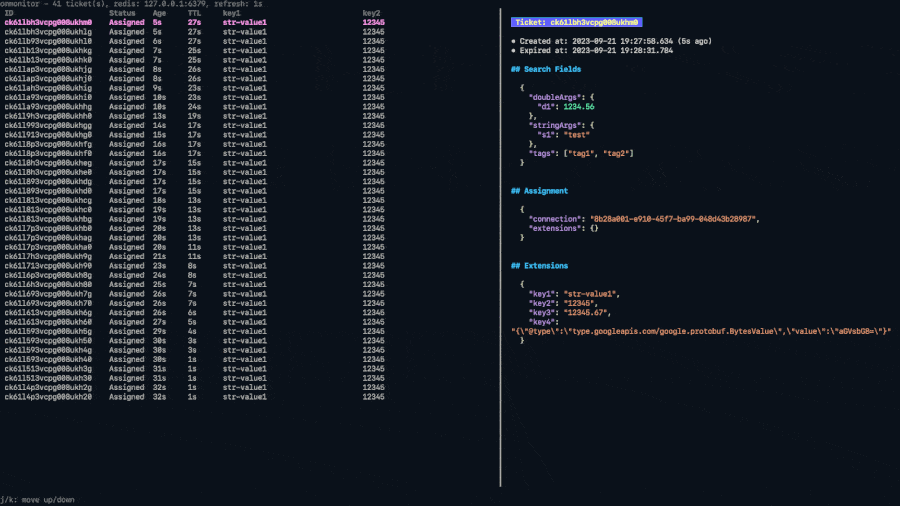

# ommonitor

Open Match Tickets Monitoring tool.

[](./ommonitor.gif)

## Install

```
go install github.com/DeNA/ommonitor/cmd/ommonitor@latest
```

## Usage

`ommonitor` connects to Open Match's Redis.
For example, you can connect to Redis on Kubernetes with the kubectl port-forward command.

```shell
# port-forwarding to Redis
kubectl port-forward -n open-match svc/open-match-redis-master 6379:6379
```

Run ommonitor with Redis address.

```shell
# Run ommonitor
ommonitor 127.0.0.1:6379
```

Several options are available. See the `ommonitor -h` for details.

## License

MIT
